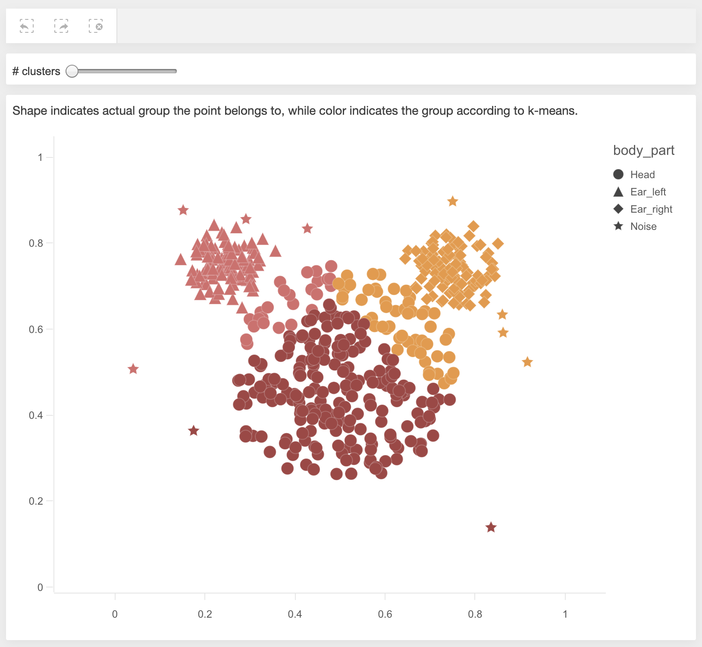

# K-means

A simple example of a k-means algorithm implemented as a server side extension.

## Prerequisites

- Node 8.0.0+
- Docker

## Run the example

1. `npm install`
1. `ACCEPT_EULA=yes ENGINE_VERSION=<tag> docker-compose up --build`
    - [Qlik Core EULA](https://core.qlik.com/eula/)
    - Go to [Docker hub](https://hub.docker.com/r/qlikcore/engine/tags) to find a `qlikcore/engine` release and specify the tagged version, e.g. `ENGINE_VERSION=12.477.0`
1. `npm run start`
1. The dev server should now be running on http://localhost:1234, where you can interact with the example data

